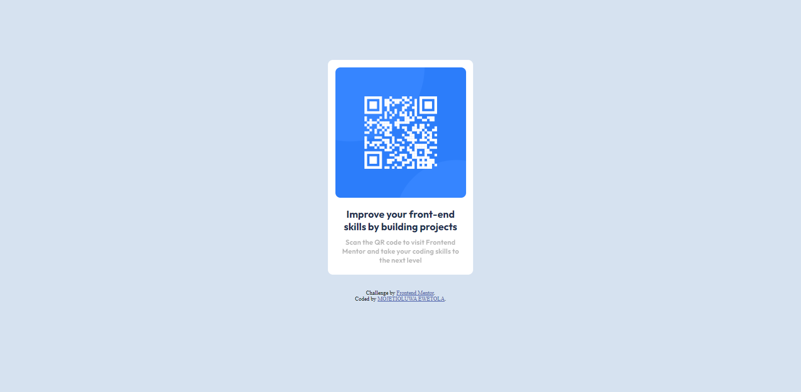

# Frontend Mentor - QR code component solution

This is a solution to the [QR code component challenge on Frontend Mentor](https://www.frontendmentor.io/challenges/qr-code-component-iux_sIO_H). Frontend Mentor challenges help you improve your coding skills by building realistic projects. 

## Table of contents

- [Overview](#overview)
  - [Screenshot](#screenshot)
  - [Links](#links)
- [My process](#my-process)
  - [Built with](#built-with)
  - [What I learned](#what-i-learned)
  - [Continued development](#continued-development)
  - [Useful resources](#useful-resources)
- [Author](#author)

## Overview

### Links

- Solution URL: [GitHub/Mojetioluwa](https://github.com/Mojetioluwa/qr-code-component-main)
- Live Site URL: [Live URL](Mojetioluwa/qr-code-component-main)

### Built with

- Semantic HTML5 markup
- CSS custom properties
- Flexbox
- Mobile-first workflow

### What I learned

- Semantic HTML5 markup
- Centering elements in CSS vertically and horizontally
- Flexbox
- Mobile-first workflow

### Continued development

- Flexbox
- Centering elements in CSS
- Mobile-first workflow

### Useful resources

- [How to Center Anything with CSS - Align a Div, Text, and More](https://www.freecodecamp.org/news/how-to-center-anything-with-css-align-a-div-text-and-more/) - This helped to learn how to center elements Vertically and Horizontally in CSS.

## Author

- Website - [Mojetioluwa Ewetola](https://github.com/Mojetioluwa)
- Frontend Mentor - [@Mojetioluwa](https://www.frontendmentor.io/profile/Mojetioluwa)
- Twitter - [@mojetioluwaDE](https://twitter.com/mojetioluwaDE)

